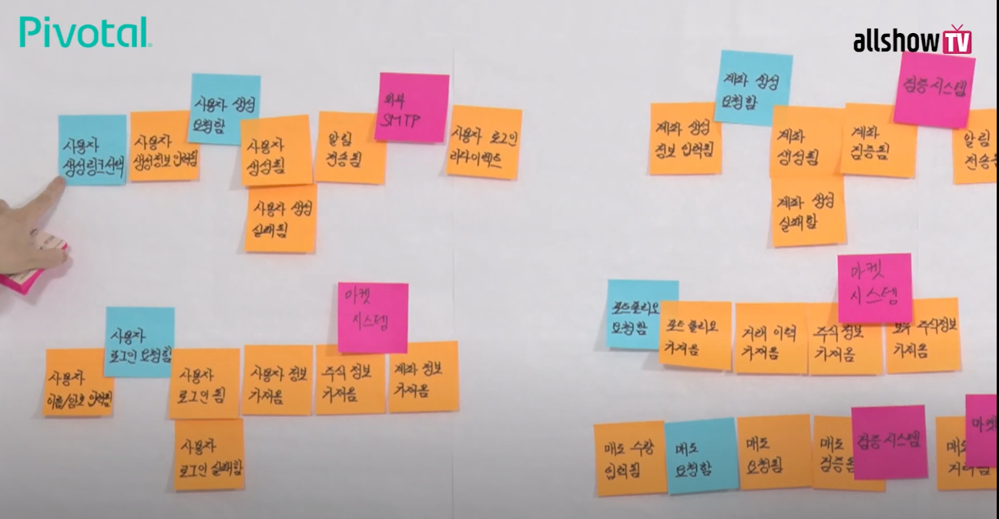
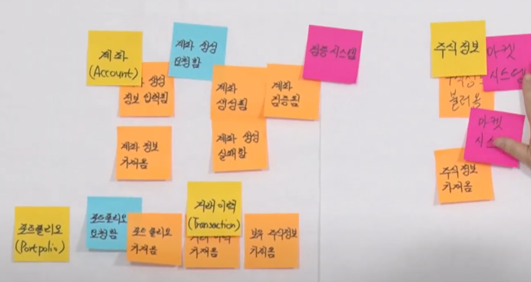
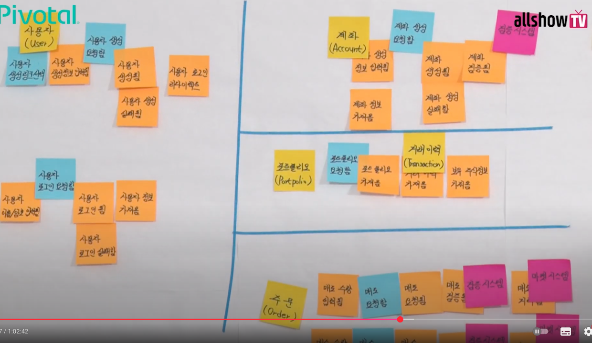
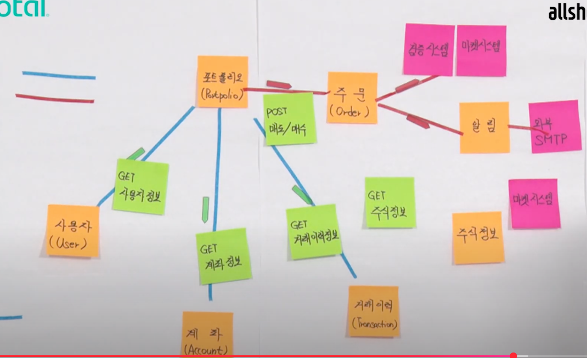
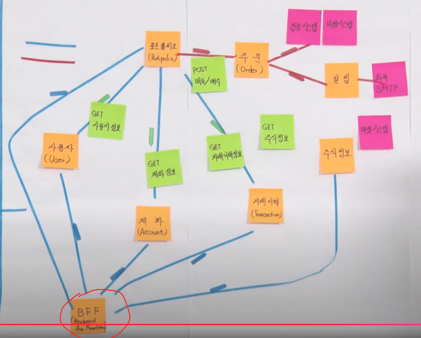
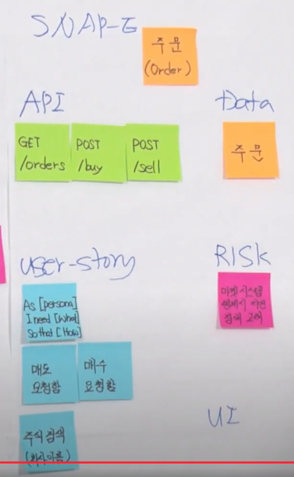

# Domain Driven Design
- 절차
  - 이벤트 시계열 데이터로 나열
  - 이벤트 그룹핑 - aggregate 구분
  - aggregate를 묶는 단위 설정
- 개발/비개발 각 팀이 함께 모여 비즈니스에 대한 커뮤니케이션이 원활할 수 있도록 이벤트, 유저 행위 등을 시계열 데이터로 관리

  - 위에 형식대로 진행을 하면서 Aggregate를 명시하면서 진행한다.
  - 스티커를 이용해 진행하면서 그룹핑을 원활하게 이동 가능

  - Aggregate(노랑색 스티커)를 통해 도메인을 분리하는 경우도 있지만, 별도의 도메인 분리 작업을 거치기도 한다.
    - 포트폴리오, 거래이력 Aggregate는 두 개의 도메인으로 분리할 필요가 없다.
  - bound context 내에 1개 이상의 Aggregate가 존재할 수 있다.
  - 주문이라는 Aggregate도 서비스 성장에 따라 "매도", "매수"로 분리 할 수도 있다.

  - 파랑색: 동기, 빨강색: 비동기

  - 별도 BFF 서버 구축, 필요에 따라 API 요청 후 데이터 반환

---
## SANP-E
- 위 과정 진행 후 SANP-E 진행
  - API
  - DATA
  - USER-STORY
    - 백로그로 들어간다.
  - RISK
  - UI

## 참고
- https://www.youtube.com/watch?v=QUMERCN3rZs
